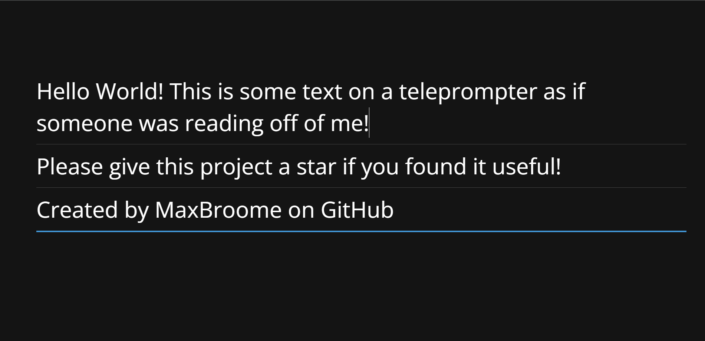

<h2>Automatically import a google document into a web-based teleprompter app!</h2>


<i>Teleprompter interface screenshot</i>

:rotating_light: This is super barebones, and <b>not</b> recomened for production! :rotating_light:

### Web interface is a modifed version from [Peter Schmalfeldt](https://github.com/manifestinteractive/teleprompter)

<h1>:memo: Requirements</h1>

- [Python](https://www.python.org/downloads/) 3.9 or later

- [Pip](https://pip.pypa.io/en/stable/installation/)

<h1>:rocket: Installing</h1>
Copy the project to your system using Git or downloading and extracting the zip file.

#### Using Git
```bash
git clone https://github.com/MaxBroome/prompty.git
```
Then naviagate to the prompty directory.
## Installing the necessary packages for the Python script
```bash
pip install -r requirements.txt
```
## Getting our Google Cloud Platform service account

1. Log in to [console.cloud.google.com](https://console.cloud.google.com)
2. Go to APIs & Services
3. Create a new credential in the "Credentials" tab
4. Choose a <i>Service Account</i> for the type of credential, and <i>Viewer</i> for the role
5. Click Done
6. Navigate to the Service Account you just created, click on the keys tab, anc create a new key in JSON
7. Download it to your machine, open it, and copy it's contents to your clipboard

Now that we have our GCP credentials, we can go back to the prompty folder.

8. Create a file called ```creds.json``` in the main directory
9. Paste the previously copied data into that file and save it

Go back to the GCP Console and copy the email address for the service account

> The Service Account email address should look like <b>`name@userlastname-000000.iam.gserviceaccount.com`</b>

10. Open the Google Document you wish to import to prompty
11. Click the share tab; and share the document with the Service Account email address, with <b>viewer</b> permissions
12. While you're still at the Google Document, copy the Document ID from the URL. It should look like this docs.google.com/document/d/<b>DOCUMENT_ID</b>/edit
13. Open the ```get-script.py``` file and replace ```<GOOGLE DOCUMENT ID>``` with your own Document ID
14. Save the edited Python script

**You're done! :tada:**

<h1>:sparkles: Using Prompty</h1>

1. Run the ```get-script.py``` Python script
```bash
python3 get-script.py
```
2. Inside of the ```web-interface``` folder, open ```index.html``` in your favorite web browser

<b>That's it!</b>
> [!WARNING]
> The teleprompter web interface does <b>not</b> automatically update after you have ran the script again. So to see the updated version of the Google Doc <i>after</i> you have ran the python script, you can just refresh the tab.

> [!TIP]
> If you need the text flipped either horizontally or vertically (shuch as use on a teleprompter). You can do this by editing the ```defaultConfig``` variable in ```web-interface/assets/js/script.v122.js``` and changing <i>flipX</i> or <i>flipy</i> to <b>true</b>.

<h1>:construction_worker: What's next</h1>

- Dockerizing the entire thing 🐋
- Auto-updating web interface
- A button or hotkey to run the Python 'get' script in the backround, and update the text
